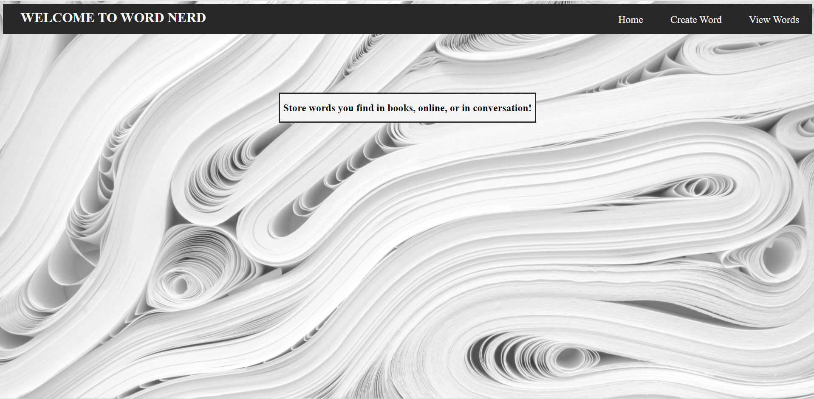
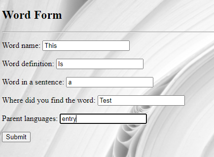
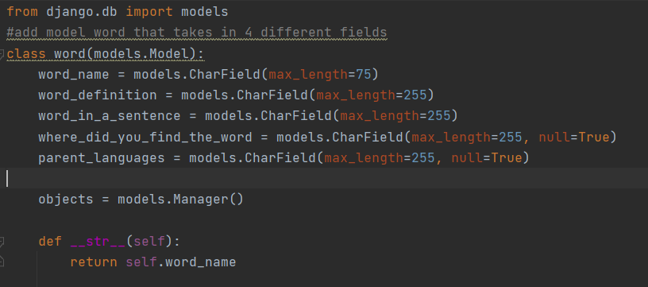
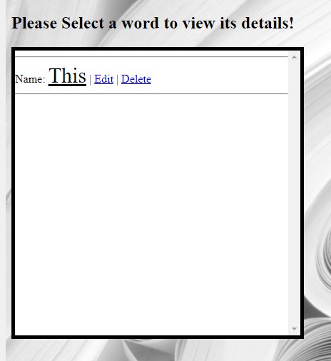
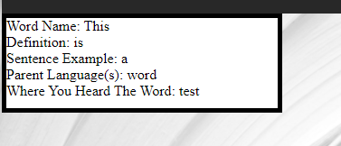

# DjangoProject | WordNerd

## Intro 
At the time I am writing this I just finished a two week study of the Python Web frame-work Django. In that time I've implemented my study by making a web app called WordNerd.
WordNerd is a CRUD application that serves the purpose of a journal for words you come across and don't understand in books, articles or wherever they come up. It works by allowing the user to store a words information in a database. This project was made as a part of a larger project with other developers contributing to it. This allowed me to work with verison control in a setting that much resembles a work environment. We had daily standup meetings to attend, along with sprint retrospectives. With that being said here is how the project works.
  

  
  
  
## C
This is the create word form used in WordNerd. It was made with the MVT design pattern that django uses. 

 

This is the model

 

and this is the The view that validates the form and pushes the data to the database.

## R 
Once the user has entered the required fields of the form the word ready to be viewed under the view words section of the nav bar.

 

The name of the word will show up in a notepad-esque CSS scroll box.
Once the user wants to retrive data from the box they simply click on the wordname.

Once the word name has been clicked the rest of that words corresponding details will appear.

## U
Let's say once the user has created their word they relised that they misspelt the example sentence and want to change it.
There's a little edit button next to the word name on the view words page which will allow them to correct their mistake.

 

## D 
Now if for some reason the user would like to delete a word they can do so with the delete button in the view words column.
This will prompt a confirmation page and once confirmed will lead one to page letting them know there action has been completed. 

## What I learned from this endeavor
From positioning elements with CSS to learning to use Django to manage data and html pages, this project taught me alot. I can now confidently give an abstract on how the MVT pattern 
works, template inheritance, connecting forms to a relational database, and other things Django. Also since this project was apart of a bigger project and had other devlopers working on their own parts, I gained experience with Version control. Though this was my first Django project this will not be my last. I had alot fun making it and it helped me fill the 
gaps of understanding in the concepts I mentioned ealier.

Thanks for reading.

  
 
 

